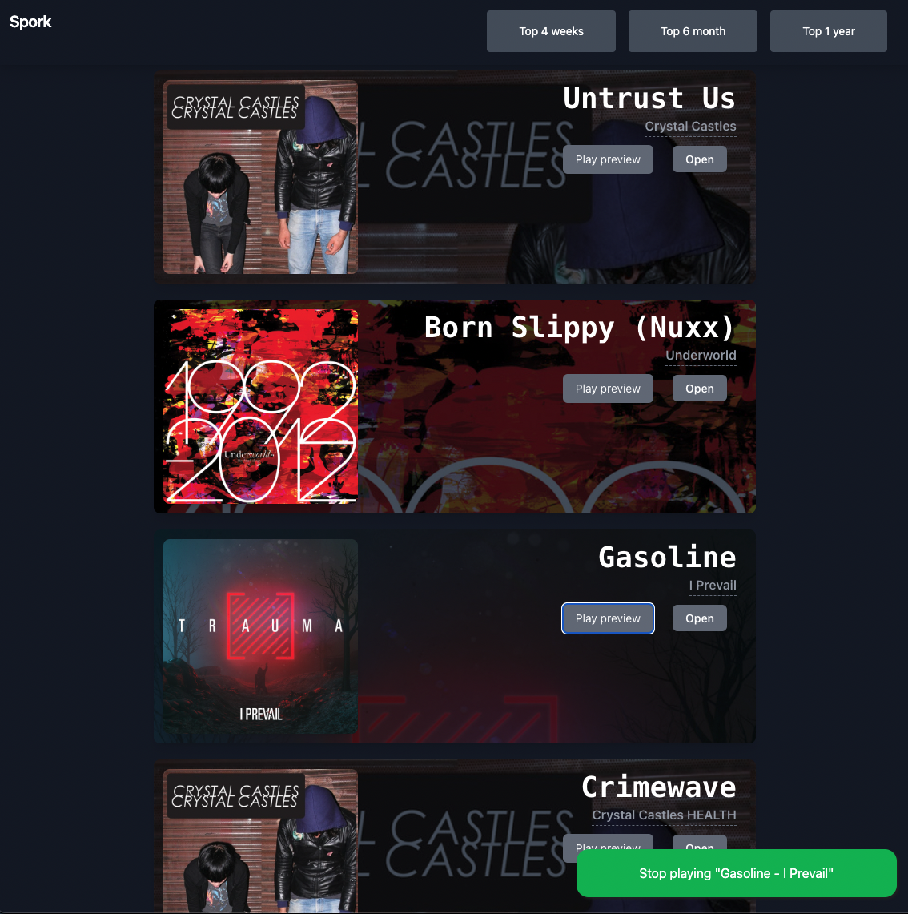

# Sporky 🎧

Show your top listened Spotify tracks with a good looking UI.

[](https://app.netlify.com/sites/sporky/deploys)



# How to use it

On the webpage just login into with your Spotify account, then authorize the app to get access to your account info (no worries, then you can revoke the access, is just needed to get only the top listened tranks).

## Project Setup

```sh
npm install
```

### Compile and Hot-Reload for Development

```sh
npm run dev
```

### Type-Check, Compile and Minify for Production

```sh
npm run build
```

### Run Unit Tests with [Cypress Component Testing](https://docs.cypress.io/guides/component-testing/introduction)

```sh
npm run test:unit # or `npm run test:unit:ci` for headless testing
```

### Run End-to-End Tests with [Cypress](https://www.cypress.io/)

```sh
npm run build
npm run test:e2e # or `npm run test:e2e:ci` for headless testing
```
